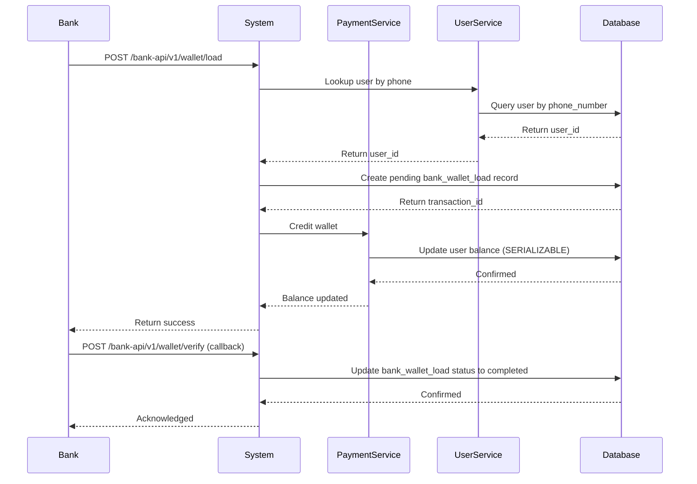

# Phone-Based Login & Bank API Integration Guide

## Overview
This document outlines the implementation of:
1. **Phone-based Authentication** - Login and transfer money using phone numbers
2. **Peer-to-Peer (P2P) Transfer** - Send money between users using phone numbers
3. **Bank API** - Allow banks to load wallet balance for customers

---

## Architecture Changes

### 1. Database Schema Updates

#### Add Phone Number to Users Table
```sql
ALTER TABLE users ADD COLUMN IF NOT EXISTS phone_number VARCHAR(20) UNIQUE;
ALTER TABLE users ADD COLUMN IF NOT EXISTS phone_verified BOOLEAN DEFAULT FALSE;

CREATE INDEX IF NOT EXISTS idx_phone_number ON users(phone_number);
```

#### Create Bank Wallet Load Transactions Table
```sql
CREATE TABLE IF NOT EXISTS bank_wallet_loads (
    id              UUID PRIMARY KEY DEFAULT gen_random_uuid(),
    user_id         UUID REFERENCES users(id),
    phone_number    VARCHAR(20) NOT NULL,
    amount          NUMERIC(15, 2) NOT NULL,
    bank_reference  VARCHAR(100) UNIQUE NOT NULL,
    bank_code       VARCHAR(20) NOT NULL,
    status          VARCHAR(20) DEFAULT 'pending', -- pending, completed, failed, reversed
    created_at      TIMESTAMP DEFAULT NOW(),
    updated_at      TIMESTAMP DEFAULT NOW(),
    completed_at    TIMESTAMP
);

CREATE INDEX IF NOT EXISTS idx_bank_phone ON bank_wallet_loads(phone_number);
CREATE INDEX IF NOT EXISTS idx_bank_reference ON bank_wallet_loads(bank_reference);
CREATE INDEX IF NOT EXISTS idx_bank_status ON bank_wallet_loads(status);
```

---

## API Endpoints

### User Service (REST)

#### 1. Register with Phone Number
**Endpoint:** `POST /register`
```json
{
  "name": "John Doe",
  "email": "john@example.com",
  "phone_number": "+977-9800000000",
  "password": "secure_password",
  "mpin": "1234"
}
```

#### 2. Login with Phone Number
**Endpoint:** `POST /login/phone`
```json
{
  "phone_number": "+977-9800000000",
  "password": "secure_password",
  "mpin": "1234"
}
```
**Response:**
```json
{
  "token": "jwt_token_here",
  "user": {
    "id": "user-uuid",
    "name": "John Doe",
    "email": "john@example.com",
    "phone_number": "+977-9800000000",
    "balance": 5000.00
  }
}
```

#### 3. Verify Phone Number (OTP)
**Endpoint:** `POST /verify-phone`
```json
{
  "phone_number": "+977-9800000000",
  "code": "123456"
}
```

#### 4. Send OTP to Phone
**Endpoint:** `POST /send-phone-otp`
```json
{
  "phone_number": "+977-9800000000"
}
```

#### 5. User Lookup by Phone
**Endpoint:** `GET /lookup/phone/:phone_number`
```
GET /lookup/phone/+977-9800000000
```
**Response:**
```json
{
  "user_id": "user-uuid",
  "name": "John Doe",
  "phone_number": "+977-9800000000"
}
```

#### 6. Get User Profile
**Endpoint:** `GET /profile` (protected)
**Response includes:**
```json
{
  "id": "user-uuid",
  "name": "John Doe",
  "email": "john@example.com",
  "phone_number": "+977-9800000000",
  "balance": 5000.00,
  "phone_verified": true
}
```

---

### Payment Service (gRPC)

#### 1. Send Payment by Phone
**Proto:**
```protobuf
service PaymentService {
  rpc SendPaymentByPhone(SendPaymentByPhoneRequest) returns (SendPaymentResponse);
}

message SendPaymentByPhoneRequest {
  string sender_phone = 1;      // Sender's phone number
  string receiver_phone = 2;    // Receiver's phone number
  double amount = 3;
  string currency = 4;
  string description = 5;
}

message SendPaymentResponse {
  string transaction_id = 1;
  string status = 2;           // completed, pending, failed
  double amount = 3;
  string message = 4;
}
```

---

### Bank API (REST)

#### Bank Service Port: 8082

#### 1. Load Wallet - Initial Request
**Endpoint:** `POST /bank-api/v1/wallet/load`
**Authentication:** Bank API Key (Header: `X-Bank-API-Key`, `X-Bank-Code`)

```json
{
  "phone_number": "+977-9800000000",
  "amount": 5000.00,
  "bank_reference": "BANK-TXN-20260515-001",
  "bank_code": "IME",
  "description": "Salary Credit"
}
```

**Response:**
```json
{
  "status": "success",
  "transaction_id": "wallet-load-uuid",
  "phone_number": "+977-9800000000",
  "amount": 5000.00,
  "wallet_balance": 15000.00,
  "bank_reference": "BANK-TXN-20260515-001",
  "timestamp": "2026-05-15T10:30:00Z"
}
```

#### 2. Load Wallet - Verification Callback
**Endpoint:** `POST /bank-api/v1/wallet/verify`
**Called by Bank after payment settlement**

```json
{
  "bank_reference": "BANK-TXN-20260515-001",
  "status": "completed",
  "timestamp": "2026-05-15T10:35:00Z",
  "signature": "hmac_signature_for_verification"
}
```

#### 3. Check Wallet Load Status
**Endpoint:** `GET /bank-api/v1/wallet/status/:transaction_id`

**Response:**
```json
{
  "transaction_id": "wallet-load-uuid",
  "status": "completed",
  "amount": 5000.00,
  "phone_number": "+977-9800000000",
  "bank_reference": "BANK-TXN-20260515-001",
  "created_at": "2026-05-15T10:30:00Z",
  "completed_at": "2026-05-15T10:35:00Z"
}
```

#### 4. Bank Webhook for Failure Notifications
**Endpoint:** `POST /bank-api/v1/wallet/failure`

```json
{
  "bank_reference": "BANK-TXN-20260515-001",
  "status": "failed",
  "reason": "User not found / Account closed / etc",
  "timestamp": "2026-05-15T10:40:00Z"
}
```

---

## Implementation Roadmap

### Phase 1: Phone-Based Login (Week 1)
- [ ] Update user model to include phone_number
- [ ] Modify registration endpoint to accept phone
- [ ] Create phone-based login endpoint
- [ ] Add phone OTP verification
- [ ] Create phone lookup endpoint

### Phase 2: P2P Phone Transfer (Week 2)
- [ ] Update payment service to accept phone numbers
- [ ] Create phone-to-ID resolver in payment service
- [ ] Implement SendPaymentByPhone RPC
- [ ] Add phone-based transfer to frontend

### Phase 3: Bank API Integration (Week 2-3)
- [ ] Create bank API service on port 8082
- [ ] Implement wallet load endpoint
- [ ] Add bank authentication middleware
- [ ] Create verification callback handler
- [ ] Setup webhook for bank notifications
- [ ] Add transaction logging

### Phase 4: Testing & Security (Week 3)
- [ ] Phone number validation (E.164 format)
- [ ] Rate limiting on phone OTP
- [ ] Bank API key rotation
- [ ] Idempotency tokens for wallet loads
- [ ] Comprehensive testing

---

## Security Considerations

### Phone Number Validation
- Use E.164 format: `+{country_code}{number}`
- Validate country-specific lengths
- Prevent duplicate phone registrations

### Bank API Security
```
1. API Key Management
   - X-Bank-API-Key header
   - X-Bank-Code header
   - IP whitelisting

2. Request Signing
   - HMAC-SHA256 signature on all requests
   - Include timestamp to prevent replay attacks
   - Request body validation

3. Idempotency
   - Use bank_reference as idempotency key
   - Prevent duplicate wallet loads
   - Handle retries gracefully

4. Rate Limiting
   - Phone OTP: 3 attempts per 15 minutes
   - Bank wallet load: 10 requests per hour per bank
   - Login attempts: 5 failures per 30 minutes
```

### Data Protection
- Encrypt phone numbers in logs
- PII compliance (GDPR, local regulations)
- Audit trail for all wallet loads
- Encryption at rest for bank credentials

---

## Database Relationships

```
users
├── phone_number (unique)
├── phone_verified (boolean)
└── balance

bank_wallet_loads
├── user_id → users.id
├── phone_number (for lookup)
├── bank_reference (unique)
├── status (pending/completed/failed/reversed)
└── amount

transactions (existing)
├── sender_id → users.id
├── receiver_id → users.id
└── amount
```

---

## Integration Flow

### User Registration with Phone
```
1. User submits registration form
2. Send OTP to phone number
3. User verifies OTP
4. Account created with phone_verified=true
5. User logged in automatically
```

### P2P Transfer by Phone
```
1. Sender enters receiver's phone number
2. Payment service looks up receiver ID
3. Validates receiver exists
4. Processes payment (existing flow)
5. Notification sent to receiver
```

### Bank Wallet Load
```
1. Bank initiates wallet load request (POST /bank-api/v1/wallet/load)
2. System creates pending bank_wallet_loads record
3. Payment service credits wallet with SERIALIZABLE isolation
4. Bank calls verification callback (POST /bank-api/v1/wallet/verify)
5. Status updated to completed
6. User receives notification
7. On failure, webhook notification sent
```

---

## Example: Bank Integration Sequence



---

## Configuration

### Environment Variables
```
# User Service
PHONE_OTP_PROVIDER=twilio|sparrow|nexmo
PHONE_OTP_API_KEY=***
PHONE_OTP_API_SECRET=***

# Bank API
BANK_API_PORT=8082
BANK_API_KEYS=IME:key1,NMB:key2,SCB:key3
BANK_WEBHOOK_SECRET=***

# Payment Service
PAYMENT_SERVICE_TIMEOUT=30s
```

---

## Testing Scenarios

### Phone Login Tests
- ✓ Valid phone + password
- ✓ Invalid phone format
- ✓ Non-existent phone
- ✓ Wrong password
- ✓ Phone not verified

### P2P Transfer Tests
- ✓ Transfer by phone number
- ✓ Receiver not found
- ✓ Insufficient balance
- ✓ Self-transfer prevention
- ✓ Amount limit validation

### Bank API Tests
- ✓ Valid bank load request
- ✓ Invalid API key
- ✓ Duplicate bank_reference
- ✓ User not found by phone
- ✓ Idempotency on retry
- ✓ Webhook verification

---

## Implementation Dependencies

```go
// Phone number validation
github.com/ttacon/libphonenumber-go

// OTP generation (if using Twilio/Nexmo)
github.com/twilio/twilio-go

// HMAC signing for bank API
crypto/hmac

// Additional logging
- Structured logging for bank transactions
- Audit trail for compliance
```

---

## Next Steps

1. **Database Migration** - Run schema updates
2. **User Service Updates** - Add phone fields and endpoints
3. **Payment Service Update** - Phone-based RPC
4. **Create Bank API Service** - New Go service on port 8082
5. **Frontend Integration** - Phone login/transfer UI
6. **Testing & Deployment** - QA and rollout plan

---

## Support & Documentation
- Bank Integration Guide: [See section above]
- Phone Number Format: E.164 (+{CC}{N})
- Rate Limits: Per endpoint in security section
- Error Codes: [To be documented]
